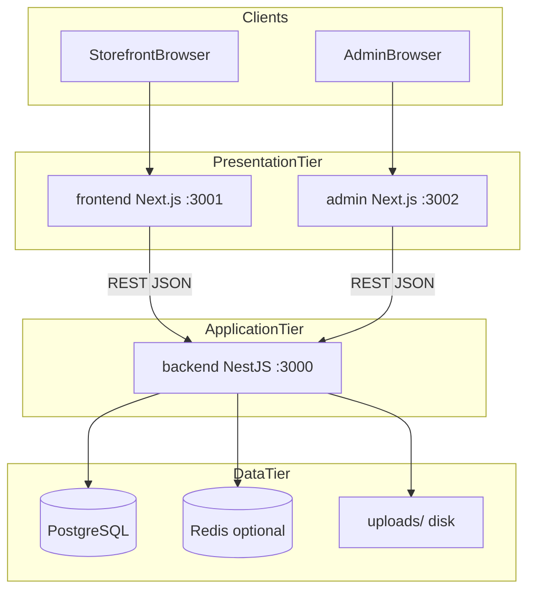

# Architecture

This document describes how the ecommerce monorepo is structured and how the storefront, admin, and API communicate.

## Monorepo overview

```
ecommerce-platform/
├── backend/          # NestJS API + Prisma
├── frontend/         # Next.js storefront
├── admin/            # Next.js admin panel
├── deploy/           # Production deployment tooling
└── docs/             # Project documentation
```

Each app has its own `package.json`, build pipeline, and environment configuration. They share no runtime process; all integration happens over HTTP.

## Three-tier architecture



| Tier | Components | Responsibility |
|------|------------|----------------|
| Presentation | `frontend/`, `admin/` | UI, routing, client state, server components |
| Application | `backend/` | Business logic, validation, auth, integrations |
| Data | PostgreSQL, optional Redis, `uploads/` | Persistence, cart/checkout sessions, media files |

## Backend (`backend/`)

**Entry:** `src/main.ts` — NestJS bootstrap, CORS, static `/uploads` serving.

**Modules** (registered in `src/app.module.ts`):

| Module | Public routes | Admin routes | Purpose |
|--------|---------------|--------------|---------|
| auth | `/auth` | — | Customer JWT auth |
| admin | — | `/admin/auth`, `/admin/bootstrap`, `/admin/users`, `/admin/roles` | Staff auth and RBAC |
| catalog | `/products`, `/categories`, `/storefront/*` | `/admin/products`, `/admin/categories`, `/admin/storefront-navigation`, … | Catalog and nav |
| inventory | `/inventory` | `/admin/inventory` | Stock levels |
| cart | `/cart` | — | Shopping cart |
| checkout | `/checkout` | — | Checkout session and place order |
| order | `/orders` | `/admin/orders` | Order lifecycle |
| payment | `/payments` | `/admin/payment-methods` | Stripe, COD |
| promotions | `/promotions` | (admin) | Coupons and campaigns |
| shipping | `/shipping` | `/admin/shipping` | Zones and methods |
| tax | `/tax` | — | Tax classes and rates |
| customer | `/customers` | `/admin/customers` | Customer records |
| customer-group | — | `/admin/customer-groups` | Segments |
| address | `/addresses` | — | Customer addresses |
| cms | `/cms` | `/admin/cms` | Pages, blocks, sliders |
| subscription | `/subscription` | `/admin/subscription` | Newsletter |

**ORM:** Prisma (`prisma/schema.prisma`) with migrations under `prisma/migrations/`.

## Storefront (`frontend/`)

**Framework:** Next.js 16 App Router (`app/`).

**Key areas:**

| Path | Role |
|------|------|
| `app/` | Routes: home, products, cart, checkout, account, CMS pages |
| `components/` | UI: layout, checkout, home sections, PLP filters |
| `lib/` | API client, Zustand stores (cart, auth), CMS services, config |
| `styles/store-themes.css` | Theme CSS variables |
| `middleware.ts` | Protects `/account`, `/profile`, `/addresses`, `/orders` (list) |

**Data fetching:** Server components call `fetchApi` with `NEXT_PUBLIC_API_URL`. Client components use `lib/api-client.ts` and Zustand stores.

**Homepage:** `app/page.tsx` loads sections via `getHomePageSections()` from a CMS block layout and live hero slider API.

## Admin (`admin/`)

**Framework:** Next.js 16 App Router.

| Path | Role |
|------|------|
| `app/login/` | Staff login (outside authenticated shell) |
| `app/(app)/` | Authenticated pages (dashboard, products, orders, CMS, …) |
| `components/` | Feature managers per domain |
| `lib/navigation.ts` | Sidebar items with `requirePermission` keys |
| `lib/route-permissions.ts` | URL → permission map for route guards |
| `middleware.ts` | Requires `admin-auth-token` cookie |

**Auth flow:** Login via `POST /admin/auth/login` → JWT stored in localStorage and `admin-auth-token` cookie → API requests send `Authorization: Bearer`.

## Data flow

### API communication

1. Browser loads Next.js app.
2. App reads `NEXT_PUBLIC_API_URL` (e.g. `http://localhost:3000`).
3. Requests go to NestJS with JSON bodies and optional `Authorization` header.
4. Backend validates JWT, runs service logic, queries Prisma/Redis.
5. Responses are JSON; product/CMS images may reference `/uploads/...` on the API host.

### Uploads

Admin uploads (products, CMS slides, mega menu banners) are stored on disk under `backend/uploads/` and served at `GET /uploads/*`. Set `PUBLIC_BASE_URL` in production so generated URLs point to the public API domain.

### Store navigation

Admin edits `storefront_nav_links` → public `GET /storefront/navigation` → frontend `header.tsx` renders links and mega menu (`store-mega-menu.tsx`). Published CMS pages are merged into the header response server-side (see [Navigation-Logic.md](./Navigation-Logic.md)).

## Authentication model

Two separate identity systems:

| Audience | Table | API prefix | Token claim |
|----------|-------|------------|-------------|
| Customers | `customers` | `/auth` | Standard user JWT |
| Staff | `admin_users` | `/admin/auth` | JWT with `typ: "admin"` |

RBAC applies only to admin users (roles → permissions). Storefront customers have no permission keys.

## Cart and checkout storage

| `REDIS_ENABLED` | Behavior |
|-----------------|----------|
| `true` | Cart and checkout sessions in Redis (`ioredis`) |
| `false` | In-memory storage in the API process (fine for local dev and small demos; data lost on restart) |

Orders are always persisted in PostgreSQL once checkout completes.

## Event-driven behavior

`@nestjs/event-emitter` is registered globally for domain events (e.g. order lifecycle side effects). See individual services for emitted events.

## Further reading

- [Technical-Setup.md](./Technical-Setup.md) — how to run all three apps locally
- [Database-Schema.md](./Database-Schema.md) — table and relationship reference
- [Navigation-Logic.md](./Navigation-Logic.md) — mega menu and CMS nav merge
