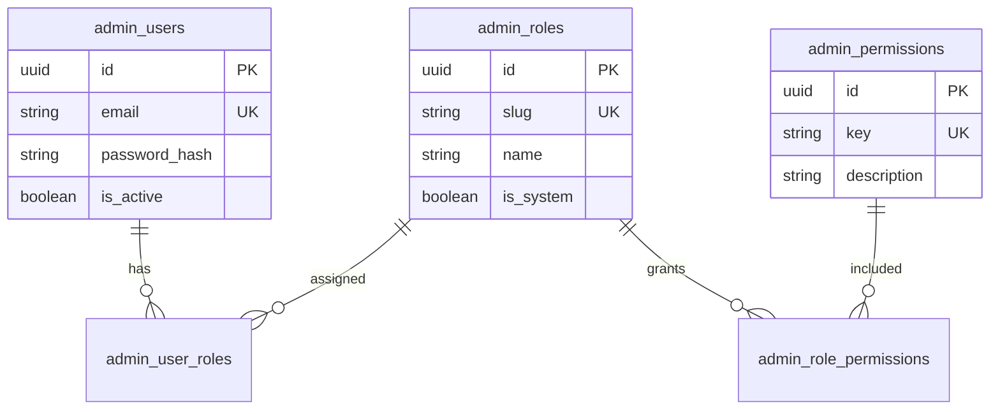
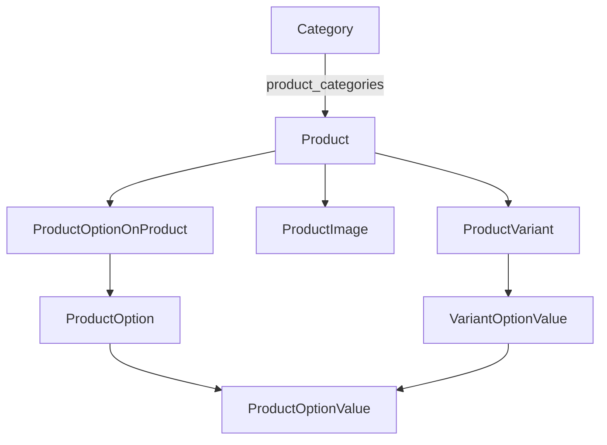

# Database Schema

PostgreSQL schema managed by **Prisma 6** (`backend/prisma/schema.prisma`). Physical table names use `@@map` (snake_case).

## Overview

The schema defines **42 models** across catalog, inventory, commerce, customers, admin RBAC, CMS, storefront configuration, and marketing.

**Not stored in PostgreSQL:**

- Shopping carts and checkout sessions (Redis or in-memory when `REDIS_ENABLED=false`)
- `promotion_logs` may reference `cart_id` / `checkout_id` as opaque strings

---

## Admin RBAC

Staff access uses classic role-based permissions, separate from storefront `customers`.



### Tables

| Table | Purpose |
|-------|---------|
| `admin_users` | Staff accounts (email, password hash, profile) |
| `admin_roles` | Named roles (`slug`, `is_system` for protected roles) |
| `admin_permissions` | Granular capability keys |
| `admin_user_roles` | Many-to-many: user ↔ role |
| `admin_role_permissions` | Many-to-many: role ↔ permission |

### Permission keys (examples)

Used by `admin/lib/navigation.ts` and `admin/lib/route-permissions.ts`:

| Key | Typical use |
|-----|-------------|
| `products.read`, `products.create`, `products.update` | Catalog |
| `inventory.read`, `inventory.manage` | Stock |
| `customers.read`, `customers.manage` | Customers |
| `orders.read`, `orders.manage`, `orders.update` | Orders |
| `promotions.manage` | Coupons |
| `shipping.manage` | Shipping zones/methods |
| `tax.manage` | Tax classes/rates |
| `payments.manage` | Payment methods |
| `cms.manage` | CMS content |
| `subscriptions.manage` | Newsletter |
| `admin.users.read`, `admin.users.create`, `admin.roles.manage` | Staff RBAC |

Permissions are **global keys** — no per-resource row-level ACL in the schema.

---

## Catalog and products

### Product graph



### Core tables

| Table | Key fields | Notes |
|-------|------------|-------|
| `products` | `sku`, `name`, `slug`, `type`, `base_price`, `status`, `visibility` | Types: `simple`, `configurable`, `bundle`, `virtual` |
| `product_variants` | `product_id`, `sku`, `price`, `attributes`, `is_active` | SKU-level sellable units |
| `product_images` | `product_id`, `variant_id?`, `url`, `is_primary`, `position` | Always tied to product; optional variant |
| `categories` | `name`, `slug`, `parent_id`, `position`, `is_active` | Self-referential tree |
| `product_categories` | `(product_id, category_id)` | Many-to-many |

### Configurable options

| Table | Role |
|-------|------|
| `product_options` | Global option definitions (e.g. Size, Flavour) |
| `product_option_values` | Values per option |
| `product_options_on_products` | Which options apply to a product |
| `product_option_values_on_products` | Allowed values per product/option |
| `variant_option_values` | Selected value per variant/option |

### Inventory

| Table | Key fields |
|-------|------------|
| `inventory_items` | `product_id?`, `variant_id?`, `warehouse_id`, `quantity`, `reserved_quantity`, `available_quantity` |
| `inventory_reservations` | `inventory_item_id`, `reference_type`, `reference_id`, `quantity`, `expires_at` |

Note: `warehouse_id` is a string FK target; there is no `warehouses` table in the schema.

---

## Storefront navigation and filters

| Table | Purpose |
|-------|---------|
| `storefront_nav_links` | Header and mega menu items; `zone`, `parent_id`, `open_mega_menu`, banner fields, optional `category_id` |
| `storefront_filters` | PLP filter definitions (`kind`, `code`, `sort_order`) |
| `storefront_filter_options` | Selectable values per filter |
| `storefront_filter_tree_nodes` | Hierarchical PLP browse tree; optional `nav_link_id` |

---

## CMS

| Table | Purpose |
|-------|---------|
| `cms_pages` | Static pages: `slug`, `status` (`draft` / `published`), `content_html`, `content_json`, SEO fields |
| `cms_blocks` | Reusable blocks by `identifier` |
| `cms_banner_sliders` | Slider config (`identifier`, `autoplay_ms`, dimensions) |
| `cms_banner_slides` | Slides per slider (image, CTA, `sort_order`) |

Published `cms_pages` are auto-merged into the storefront header nav by the API (see [Navigation-Logic.md](./Navigation-Logic.md)).

---

## Customers

| Table | Purpose |
|-------|---------|
| `customer_groups` | Segments, default group, optional discount |
| `customers` | Email, optional `password_hash`, `is_guest`, `customer_group_id` |
| `customer_addresses` | Billing/shipping addresses with default flags |
| `account_creation_tokens` | Post-checkout account creation tokens |

Storefront auth uses `customers`, not `admin_users`.

---

## Orders and payments

### Order snapshot pattern

Orders store **denormalized snapshots** at checkout time (addresses, line items, totals) so historical orders remain accurate if catalog prices change.

| Table | Purpose |
|-------|---------|
| `orders` | `order_number`, statuses, customer snapshot, totals, `applied_price_rules` JSON |
| `order_items` | Product snapshot per line (sku, name, price, qty) |
| `order_shipping` | 1:1 shipping method snapshot, tracking |
| `order_taxes` | Tax lines applied to order |
| `payment_methods` | Configurable methods (Stripe, COD, `config` JSON) |
| `payments` | Payment attempts linked to `order_id` |

### Promotions

| Table | Purpose |
|-------|---------|
| `promotions` | Rules, codes, discount config, conditions |
| `promotion_products` | Scope: product, variant, or category |
| `promotion_customer_groups` | Include/exclude groups |
| `promotion_logs` | Audit; optional `cart_id`, `checkout_id`, `order_id` |

---

## Shipping and tax

| Table | Purpose |
|-------|---------|
| `shipping_zones` | Geographic coverage (JSON), priority |
| `shipping_methods` | Methods per zone, pricing `config` |
| `shipping_method_customer_groups` | Group-specific shipping rules |
| `tax_classes` | Product tax classification |
| `taxes` | Rates by country/region, linked to class |

---

## Marketing

| Table | Purpose |
|-------|---------|
| `subscribers` | Newsletter emails and `source` |

---

## Migrations and seed

| Resource | Path |
|----------|------|
| Schema | `backend/prisma/schema.prisma` |
| Migrations | `backend/prisma/migrations/` |
| Seed script | `backend/prisma/seed.ts` |

Apply migrations:

```bash
cd backend
npx prisma migrate deploy
npm run prisma:seed
```

Inspect data:

```bash
npx prisma studio
```

---

## Design notes

| Topic | Detail |
|-------|--------|
| Soft delete | `products.deleted_at` for soft-deleted products |
| Tax class on product | `products.tax_class_id` stored as scalar (no Prisma relation to `tax_classes`) |
| Payment ↔ Order | `payments.order_id` exists; `Order` model has no `payments[]` back-relation in Prisma |
| Cart storage | Application layer only (Redis/memory), not relational tables |

## Related docs

- [Architecture.md](./Architecture.md) — how services use these tables
- [Technical-Setup.md](./Technical-Setup.md) — migration commands
