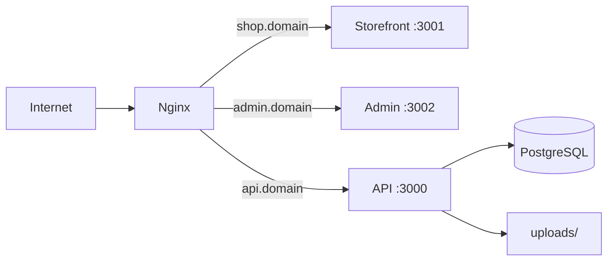

# Deployment Guide

Summary of deploying the ecommerce platform to a **single Ubuntu VPS** for live demos. Full scripts and templates live in [`../deploy/`](../deploy/).

## Target architecture



| Public URL | Internal port | App |
|------------|---------------|-----|
| `https://shop.yourdomain.com` | 3001 | Next.js storefront |
| `https://admin.yourdomain.com` | 3002 | Next.js admin |
| `https://api.yourdomain.com` | 3000 | NestJS API + `/uploads` |

Ports 3000–3002 are **not** exposed publicly; only Nginx (80/443) faces the internet.

## Server specifications

| Tier | vCPU | RAM | Disk | Use case |
|------|------|-----|------|----------|
| Minimum | 2 | 4 GB | 40 GB SSD | Small demo, few concurrent users |
| **Recommended** | 2–4 | **8 GB** | 60–80 GB SSD | Client demo with admin + builds |

**OS:** Ubuntu 22.04 or 24.04 LTS.

See [../deploy/PROVISIONING.md](../deploy/PROVISIONING.md) for provider examples and DNS setup (A records for `shop`, `admin`, `api`).

## Demo simplifications

Configured by default in `deploy/scripts/install-env.sh`:

- `REDIS_ENABLED=false` — in-memory cart/checkout (no Redis process)
- Production builds only (`npm run build` + `next start` / `node dist/main`)
- Strong `JWT_SECRET` required when `NODE_ENV=production`

Persist `backend/uploads/` across deploys if you use admin image uploads.

## Deployment workflow

Run from the repo root on the server (e.g. `/var/www/ecommerce-platform`).

### 1. Configure environment

```bash
cp deploy/env/demo.env.example deploy/env/demo.env
nano deploy/env/demo.env
```

Set: `SHOP_DOMAIN`, `ADMIN_DOMAIN`, `API_DOMAIN`, `POSTGRES_*`, `JWT_SECRET`, `ADMIN_EMAIL`, `ADMIN_PASSWORD`, `CERTBOT_EMAIL`.

### 2. Install server stack

```bash
sudo bash deploy/scripts/setup-server.sh
```

Installs: Node 20, PostgreSQL, Nginx, PM2, Certbot, UFW (SSH + Nginx Full).

Creates PostgreSQL database/user if `demo.env` is present.

### 3. Generate app env files

```bash
bash deploy/scripts/install-env.sh
```

Writes:

- `backend/.env` — production API config, `CORS_ORIGIN`, `PUBLIC_BASE_URL`
- `frontend/.env` — `NEXT_PUBLIC_API_URL`, theme vars
- `admin/.env.local` — `NEXT_PUBLIC_API_URL`

### 4. Build and start apps (PM2)

```bash
bash deploy/scripts/deploy.sh
```

For each app: `npm ci`, build, then PM2 start/reload from `deploy/pm2/ecosystem.config.cjs`.

| PM2 name | Process |
|----------|---------|
| `ecommerce-api` | `backend/dist/main.js` :3000 |
| `ecommerce-storefront` | `next start -p 3001` |
| `ecommerce-admin` | `next start -p 3002` |

After first deploy:

```bash
pm2 startup
# Run the command PM2 prints, then:
pm2 save
```

### 5. Nginx and HTTPS

```bash
sudo bash deploy/scripts/configure-nginx.sh
```

- Renders `deploy/nginx/ecommerce-demo.conf.template` with your domains
- Enables site, runs Certbot for TLS + HTTP→HTTPS redirect

### 6. Database bootstrap

```bash
bash deploy/scripts/bootstrap-demo.sh
```

- `npx prisma migrate deploy`
- Optional seed (`SEED_DEMO_DATA=true` by default)
- `POST /admin/bootstrap/first-user` for first admin (requires API running on localhost:3000)

## Environment alignment checklist

| Variable | Value |
|----------|--------|
| Backend `CORS_ORIGIN` | `https://shop...`, `https://admin...` (exact, no trailing slash) |
| Backend `PUBLIC_BASE_URL` | `https://api...` |
| Backend `FRONTEND_URL` | `https://shop...` |
| Frontend/admin `NEXT_PUBLIC_API_URL` | `https://api...` |

## Operations

```bash
pm2 status
pm2 logs ecommerce-api
pm2 restart all

# Redeploy after git pull
bash deploy/scripts/deploy.sh
```

## Pre-demo checklist

1. Migrations applied and seed data present
2. Admin user can log in at `https://admin...`
3. Storefront loads products and navigation
4. HTTPS valid on all three hostnames
5. Uploaded images resolve at `https://api.../uploads/...`
6. Stripe (if used): keys configured in **Admin → Payments**, not only env
7. No `next dev` processes running on the server

## Alternatives

| Approach | When to use |
|----------|-------------|
| **Single VPS (this guide)** | Lowest cost, full control |
| **VPS + managed Postgres** | Offload DB memory (Neon, Supabase, DO Managed DB) |
| **PaaS split** | Fastest setup: API on Railway/Render, frontends on Vercel, managed DB |

There is no Docker Compose in the repo; containers can be added separately.

## File reference

| Path | Purpose |
|------|---------|
| [../deploy/README.md](../deploy/README.md) | Deploy folder index |
| [../deploy/PROVISIONING.md](../deploy/PROVISIONING.md) | VPS sizing and DNS |
| [../deploy/scripts/](../deploy/scripts/) | Automation scripts |
| [../deploy/pm2/ecosystem.config.cjs](../deploy/pm2/ecosystem.config.cjs) | PM2 definitions |
| [../deploy/nginx/ecommerce-demo.conf.template](../deploy/nginx/ecommerce-demo.conf.template) | Nginx template |

## Related docs

- [Technical-Setup.md](./Technical-Setup.md) — local development
- [Architecture.md](./Architecture.md) — system overview
