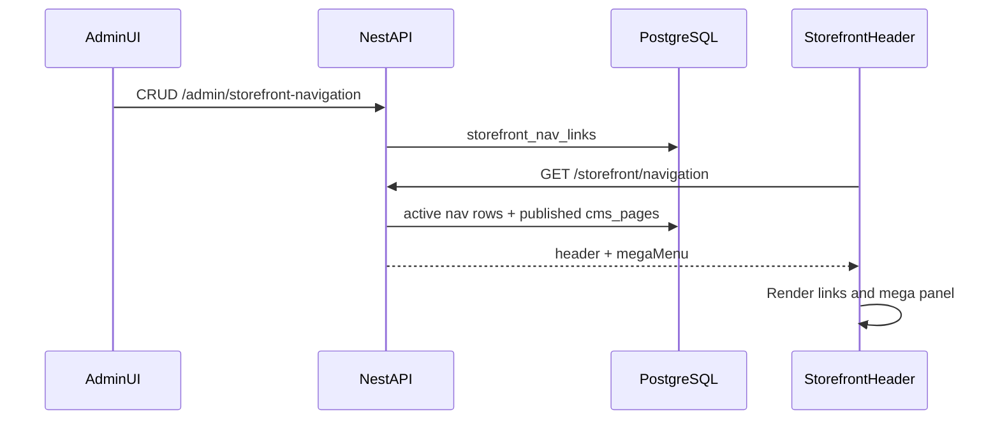

# Navigation Logic

How store navigation, the layered mega menu, CMS page links, and the PLP browse tree work end to end.

## Overview

Navigation is **admin-configurable** and served to the storefront through a single public API. The header does not hard-code menu items (except a client-side fallback if the API fails).



## Data model

Table: `storefront_nav_links` (Prisma model `StorefrontNavLink`).

| Field | Purpose |
|-------|---------|
| `zone` | `header` (top bar) or `mega` (layered menu tree) |
| `parent_id` | Self-reference for mega menu hierarchy |
| `label`, `href` | Display text and URL |
| `secondary_label` | Second trigger label when `open_mega_menu` is true (e.g. "Categories") |
| `open_mega_menu` | Header item opens mega panel on hover |
| `category_id` | Optional link to category; href resolves to `/categories/{slug}` |
| `kind` | `LINK` or legacy `MEGA_CATEGORIES` |
| `sort_order`, `is_active` | Ordering and visibility |
| `banner_image_url`, `banner_href`, `banner_alt` | Optional mega menu promo column |

Header links are **flat** (no `parent_id`). Mega menu items form a **tree** under `zone = mega`.

## Admin: Store Navigation

**Route:** `/store-navigation`  
**Files:**

- `admin/app/(app)/store-navigation/page.tsx`
- `admin/components/store-navigation/store-navigation-manager.tsx`
- `admin/components/store-navigation/mega-menu-banner-section.tsx`
- `admin/lib/api/storefront-navigation.ts`

**Permission:** `products.read` (sidebar entry in `admin/lib/navigation.ts`).

### Header zone

- Add/edit/reorder top-bar links (Home, Products, Track order, Cart, etc.).
- Enable **Opens mega menu panel** on a header row to show a split trigger: primary label (e.g. "Products" → `/products`) and secondary label (e.g. "Categories" → opens panel).
- Header links cannot have a parent.

### Mega zone

- Hierarchical tree: root columns (e.g. Flavour, Signature Items, Weight) and nested children/grandchildren.
- Drag-and-drop reorder within the admin UI.
- Links can point to custom URLs or bound categories.

### Mega menu banner

Configured in a **separate section** on the Store Navigation page (not inside the link edit modal):

- Upload image via `POST /admin/storefront-navigation/banner/upload`
- Fields: `bannerImageUrl`, `bannerHref`, `bannerAlt` stored on the header item with `openMegaMenu`
- **Storefront shows this image only** when uploaded — no automatic product or static fallback images

## Public API

**Endpoint:** `GET /storefront/navigation`  
**Controller:** `backend/src/catalog/controllers/storefront-nav.controller.ts`  
**Service:** `backend/src/catalog/services/storefront-nav.service.ts`

**Response:**

```json
{
  "data": {
    "header": [
      {
        "id": "...",
        "label": "Products",
        "secondaryLabel": "Categories",
        "href": "/products",
        "sortOrder": 10,
        "openMegaMenu": true,
        "bannerImageUrl": null,
        "bannerHref": null,
        "bannerAlt": null
      }
    ],
    "megaMenu": [
      {
        "id": "...",
        "label": "Flavour",
        "href": "/categories/flavour",
        "sortOrder": 0,
        "children": [ ... ]
      }
    ]
  }
}
```

### Category href resolution

If `category_id` is set, public `href` becomes `/categories/{slug}` regardless of the stored `href` string.

### CMS auto-navigation

Method: `appendPublishedCmsPages()` in `storefront-nav.service.ts`.

1. Load all `cms_pages` where `status = published`, ordered by title.
2. Skip slugs in the reserved list (e.g. `products`, `cart`, `login`, `account`, …).
3. Skip pages whose URL already exists in the header.
4. Insert synthetic header items (`id: cms:{pageId}`, `label: page.title`, `href: /{slug}`) **immediately before** the Cart link.
5. Assign `sortOrder` after the last non-cart item.

Draft CMS pages do **not** appear in the nav. Removing a page from CMS removes it from the nav on the next API request (no manual nav entry required).

## Storefront implementation

**Files:**

- `frontend/components/layout/header.tsx`
- `frontend/components/layout/store-mega-menu.tsx`
- `frontend/lib/api-client.ts` — types and `storefrontNavApi.getNavigation()`
- `frontend/lib/mega-menu-config.ts` — category badges (Hot/New), env helpers

### Header load

On mount, `header.tsx` calls `storefrontNavApi.getNavigation()`. If the request fails or returns empty header, it falls back to `STOREFRONT_NAV_FALLBACK` in `api-client.ts`.

### Desktop mega menu

Component: `DesktopShopMegaMenu` in `store-mega-menu.tsx`.

| Behavior | Detail |
|----------|--------|
| Open trigger | **Categories** button only (`secondaryLabel`); hovering **Products** closes the panel |
| Columns | Up to 4 root mega nodes, each with scrollable child lists |
| Panel position | Portaled to `document.body`, fixed directly below `header.site-header` |
| z-index | Panel `50`, header `60` (panel does not cover navbar) |
| Banner column | 252px wide; rendered only when admin `bannerImageUrl` is set |
| Close delay | 180ms hover grace when moving between trigger and panel |

### Mobile

- Hamburger opens a full-screen drawer (`z-[200]`).
- Mega roots render as `MobileCategoryAccordions` (nested `<details>`).
- Auth links (login/sign up or profile) appear in the drawer.

### Cart link

Items whose href is `/cart` are rendered as a shopping bag icon (with quantity badge), not text. Cart is typically last in the header row.

## PLP browse tree (related)

Store filters can mirror mega menu structure via `storefront_filter_tree_nodes.nav_link_id`, linking PLP sidebar browse nodes to nav rows. Managed under **Admin → Store filters** (`/store-filters`). See `storefront-filter.service.ts` for sync logic.

## Styling

Mega menu colors and layout are documented in [UI-UX-Standards.md](./UI-UX-Standards.md). Selectors use `.store-mega-menu-panel` (panel is portaled outside `<header>`).

## Summary

| Concern | Where it lives |
|---------|----------------|
| Configure links | Admin → Store navigation |
| Configure mega banner | Admin → Store navigation → Mega menu banner |
| Publish CMS nav links | Admin → CMS → set page status to **published** |
| Serve merged nav | `GET /storefront/navigation` |
| Render UI | `header.tsx` + `store-mega-menu.tsx` |
